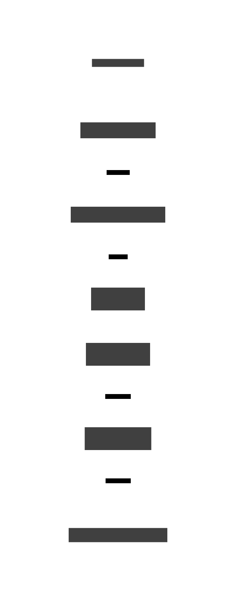
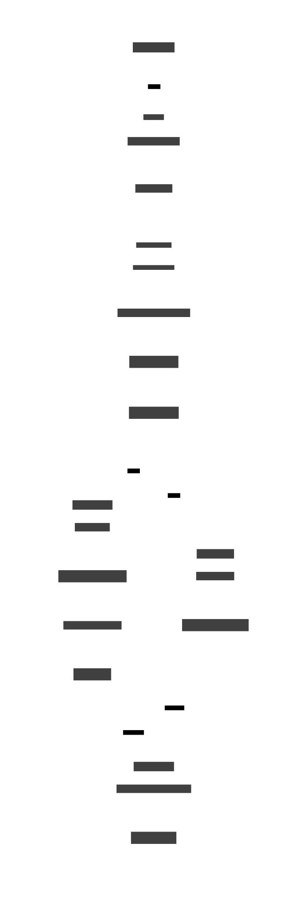

# CI/CD · Modelos ML en SageMaker — Diseño Objetivo

> **Fase:** Discovery / exploración — sin producción, sin endpoints  
> **Stack:** GitHub Actions · AWS ECR · AWS S3 · SageMaker Studio · Sonarcloud · Fluid Attacks  
> **Auth AWS:** ⚠️ OIDC propuesto — pendiente confirmación con equipo AWS  
> **Base:** spec `cicd-magic-github.md` + mejoras recomendadas

---

## Resumen

El Data Scientist hace push a su rama → el CI/CD valida la calidad del código, construye las imágenes Docker de cada step, sube los artefactos a S3 y registra el pipeline en SageMaker Studio. El equipo lo ejecuta **manualmente** desde Studio.



---

## Estructura del repositorio

Un solo repositorio, una branch por modelo. El CI/CD se dispara únicamente en la branch que recibe el push — sin filtros de paths adicionales, la convención de naming ya aísla el scope.

```
github-repository/
├── model-1/                        ← branch: model-1
│   └── training/
│       ├── pipeline.py             ← define el grafo del SageMaker Pipeline
│       └── artifacts/
│           ├── preprocessing/
│           │   ├── main.py         ← lógica del step
│           │   ├── pyproject.toml
│           │   └── Dockerfile      ← imagen con main.py copiado adentro
│           ├── training/
│           │   ├── main.py
│           │   ├── pyproject.toml
│           │   └── Dockerfile
│           └── validation/
│               ├── main.py
│               ├── pyproject.toml
│               └── Dockerfile
├── model-2/                        ← branch: model-2
│   └── ...
└── model-N/
```

---

## Flujo CI/CD — por modelo



> **Job 2 y Job 3 corren en paralelo** — el build de imágenes y el upload de assets son independientes entre sí.  
> **Job 4 espera a ambos** antes de ejecutar el upsert del pipeline.

---

## Job 2 · Build de imágenes Docker

Cada step tiene su propio `Dockerfile`. El CI/CD los construye y pushea **en paralelo** usando una matrix con `docker/build-push-action@v7`.

```
artifacts/preprocessing/Dockerfile  →  ECR: model-X:preprocessing-<SHA>   (inmutable)
                                             model-X:preprocessing           (mutable)
artifacts/training/Dockerfile        →  ECR: model-X:training-<SHA>
                                             model-X:training
artifacts/validation/Dockerfile      →  ECR: model-X:validation-<SHA>
                                             model-X:validation
```

### Estrategia de tags — doble tag por diseño

| Tag | Ejemplo | Propósito |
|-----|---------|-----------|
| `:step-SHA` | `:preprocessing-a3f9c12` | **Inmutable** — trazabilidad exacta de qué imagen corrió en cada ejecución |
| `:step` | `:preprocessing` | **Mutable** — `pipeline.py` lo referencia fijo; se actualiza automáticamente en cada push |

> ⚠️ **Requisito ECR:** el repositorio debe configurarse con `imageTagMutability: IMMUTABLE_WITH_EXCLUSION` y un filtro de exclusión para el tag mutable. Sin esto, ECR rechaza la sobreescritura del tag mutable.

### Cache por step — evitar race condition en matrix

Cada job del matrix necesita su propio tag de cache. Si comparten el mismo tag, el último en terminar sobreescribe el cache de los demás.

```yaml
cache-from: type=registry,ref=<ecr>/<repo>:buildcache-${{ matrix.step }}
cache-to:   type=registry,ref=<ecr>/<repo>:buildcache-${{ matrix.step }},mode=max,image-manifest=true,oci-mediatypes=true
```

> `image-manifest=true` y `oci-mediatypes=true` son **requeridos** para compatibilidad con ECR.

---

## Job 3 · Upload de assets a S3

```
s3://bucket/model_pipelines/model-X/
└── training/
    ├── pipeline.py
    └── artifacts/
        ├── preprocessing/
        │   ├── main.py
        │   ├── pyproject.toml
        │   └── Dockerfile
        ├── training/  ...
        └── validation/  ...
```

> **Ruta estática** — el CI/CD siempre sobreescribe la misma key en S3.  
> `pipeline.py` referencia estos assets por ruta fija y no necesita actualizarse entre ejecuciones.

---

## Ejecución del pipeline en SageMaker Studio

Una vez que el CI/CD registra el pipeline, el equipo lo dispara **manualmente** desde SageMaker Studio. Cada step corre como un container independiente:

```
ECR (model-X:preprocessing)
    └─→ container arranca con main.py ya copiado adentro (Dockerfile)
            └─→ python main.py
                    ├─→ lee datos de S3
                    └─→ escribe train.csv, val.csv a S3

Step 1 · Preprocessing   →  train.csv, val.csv
    └─→ Step 2 · Training HPO   →  mejor modelo
            └─→ Step 3 · Validation   →  reportes a S3
```

> El CI/CD **registra y actualiza** la definición del pipeline — nunca lo ejecuta.

---

## Gates de seguridad

| Gate | Herramienta | Bloquea | Notas |
|------|-------------|:-------:|-------|
| Calidad de código | `SonarSource/sonarqube-scan-action@v7` | No — informativo | Reemplaza `sonarcloud-github-action` (deprecada). Gratis para OSS. |
| Seguridad Python | `PyCQA/bandit-action@v1` + Semgrep `p/security-audit` | No — informativo | No usar `p/ml` — no existe. `semgrep/semgrep-action` deprecada; usar container `semgrep/semgrep`. |
| SAST | **`fluidattacks/sast-action@v1`** | **Sí — HIGH/CRITICAL** | Genera SARIF. Requiere `strict: true` en `.sast.yaml`. |
| Vulnerabilidades en imágenes | A definir | — | JFrog Xray o ECR Enhanced Scanning (Inspector v2). |
| Ejecución del pipeline | Manual | — | SageMaker Studio. |

---

## Alineación con DevSecOps

| Capacidad | Herramienta | En este CI/CD | Estado |
|-----------|-----------------|---------------|:------:|
| CI/CD | Azure Pipelines | GitHub Actions | ✅ aprobado para repos GitHub + AWS |
| Calidad | Sonarcloud | `SonarSource/sonarqube-scan-action@v7` | ✅ licencia a confirmar — gratis para OSS |
| SAST | Fluid Attacks | `fluidattacks/sast-action@v1` | ✅ |
| Registry de imágenes | JFrog / ACR | AWS ECR | ✅ nativo SageMaker |
| Scan de imágenes | JFrog Xray | A definir | ⏳ pendiente |
| IaC | Terraform | Terraform (OIDC Role + ECR) | ⏳ fuera de scope inicial |

---

## Mejoras sobre el spec original

| Aspecto | Spec original | Mejora aplicada | Razón |
|---------|--------------|-----------------|-------|
| Tags ECR | `:step` mutable | `:step-SHA` inmutable + `:step` mutable | Trazabilidad. Requiere `IMMUTABLE_WITH_EXCLUSION`. |
| Cache Docker en matrix | No mencionado | Tag único por step (`buildcache-${{ matrix.step }}`) | Sin esto hay race condition — el último job sobreescribe el cache de los demás. |
| Paths filter | No mencionado | No necesario | `paths` en GHA no acepta variables. La convención de branch-por-modelo ya filtra. |
| Auth AWS | No mencionado | OIDC propuesto | Paso 0 del CI/CD — sin auth no se puede tocar AWS. |
| Gates de seguridad | No mencionados | Job 1: Sonarcloud + Fluid Attacks + Semgrep/Bandit | Alineación DevSecOps. |
| Deploy SageMaker | "Desplegar pipeline" | `pipeline.upsert(role_arn, tags=[...])` | Idempotente — crea si no existe, actualiza si ya existe. |
| Paralelismo | No mencionado | Job 2 (build) ‖ Job 3 (upload) | Ambos son independientes — no tiene sentido secuenciarlos. |
| `ecr:CreateRepository` | "si no existe" | `try/except RepositoryAlreadyExistsException` | La API **no** es idempotente — lanza excepción si el repo ya existe. |

---

## ⚠️ Preguntas abiertas — para la reunión

**1 · Auth AWS**  
OIDC es la práctica recomendada (sin IAM keys de larga duración), pero requiere un IAM Role + OIDC Identity Provider preconfigurado en la cuenta AWS discovery. **Sin auth, el CI/CD no puede operar en AWS.**  
Alternativa: IAM User con keys como GitHub Secrets — más simple, menor seguridad.

**2 · Sonarcloud**  
¿El equipo ya tiene organización configurada, o hay que solicitarla?

**3 · Execution Role en SageMaker Studio**  
¿Tiene permisos de ECR pull y S3 read? Si falta algún permiso, el pipeline falla en runtime — no en el CI/CD, lo que dificulta el diagnóstico.

**4 · Scan de imágenes Docker**  
¿Hay mandato de JFrog Xray?
- **Sí** → agregar step de push/scan a JFrog antes del push a ECR.
- **No** → ECR Enhanced Scanning (Inspector v2) cubre el registry de forma continua.

---

## Referencia · Versiones de GitHub Actions validadas

| Action | Versión | Notas |
|--------|---------|-------|
| `aws-actions/configure-aws-credentials` | `@v6` (v6.1.1) | OIDC. IAM Role necesita `max session ≥ 7200s`. |
| `SonarSource/sonarqube-scan-action` | `@v7` (v7.1.0) | Reemplaza `sonarcloud-github-action` (deprecada). |
| `fluidattacks/sast-action` | `@v1` (v1.1.0) | SARIF output. `strict: true` bloquea en HIGH/CRITICAL. |
| Semgrep | container `semgrep/semgrep` + `semgrep ci` | `semgrep/semgrep-action` deprecada. Usar `p/security-audit`. |
| `PyCQA/bandit-action` | `@v1` (v1.0.1) | Action oficial de Bandit. |
| `docker/build-push-action` | `@v7` (v7.1.0) | v5 y v6 desactualizados. |
| `docker/setup-buildx-action` | `@v4` (v4.0.0) | v3 desactualizado. |
| `actions/checkout` | `@v4` | — |

---

## Referencia · Permisos IAM mínimos del GitHub Actions Role

```yaml
# SageMaker
- sagemaker:CreatePipeline
- sagemaker:UpdatePipeline
- sagemaker:DescribePipeline
- iam:PassRole              # pasar la SM Execution Role al pipeline

# S3
- s3:PutObject
- s3:GetObject

# ECR
- ecr:GetAuthorizationToken
- ecr:BatchCheckLayerAvailability
- ecr:PutImage
- ecr:InitiateLayerUpload
- ecr:UploadLayerPart
- ecr:CompleteLayerUpload
- ecr:CreateRepository      # NO es idempotente — manejar RepositoryAlreadyExistsException
- ecr:DescribeRepositories
```
