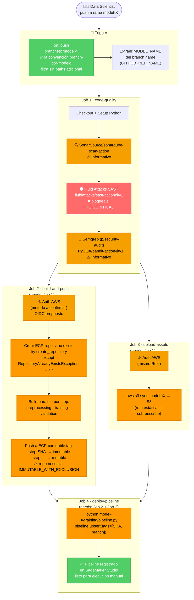

# CI/CD — Modelos ML en SageMaker (Diseño Ideal)

> **Contexto**: Discovery / exploración. Sin producción, sin endpoints.  
> **Stack**: GitHub Actions · S3 · ECR · SageMaker Studio · Sonarcloud · Fluid Attacks  
> **Auth AWS**: ⚠️ OIDC propuesto — método a confirmar con el equipo AWS/IBK  
> **Base**: spec `cicd-magic-github.md` + mejoras recomendadas

---

## 1. La idea en una línea

> El Data Scientist hace push a su rama → el CI/CD valida, buildea las imágenes del modelo, sube el código a S3 y registra el pipeline en SageMaker Studio → el equipo lo ejecuta manualmente.

---

## 2. Estructura del repositorio (un solo repo, muchos modelos)

```
github-repository/
├── model-1/                        ← rama: model-1
│   └── training/
│       ├── pipeline.py             ← (C) define el grafo del SM Pipeline
│       └── artifacts/
│           ├── preprocessing/
│           │   ├── main.py         ← lógica del step
│           │   ├── pyproject.toml
│           │   └── Dockerfile      ← (B) imagen con main.py adentro
│           ├── training/
│           │   ├── main.py
│           │   ├── pyproject.toml
│           │   └── Dockerfile
│           └── validation/
│               ├── main.py
│               ├── pyproject.toml
│               └── Dockerfile
├── model-2/                        ← rama: model-2
│   └── ...
└── model-N/
```

> **Un repo, múltiples branches** — una branch por modelo.  
> Cada step tiene su propio `Dockerfile` con el `main.py` copiado adentro.  
> El CI/CD solo corre para el modelo cuya branch recibió el push.

---

## 3. Flujo completo — por modelo



> **Job 2 y Job 3 corren en paralelo** — el build de imágenes y el upload de assets son independientes.  
> **Job 4 espera a ambos** antes de hacer el upsert del pipeline.

---

## 4. Detalle: cómo se buildean las imágenes (Job 2)

Cada step tiene su `Dockerfile`. El CI/CD buildea y pushea **en paralelo** usando una matrix con `docker/build-push-action@v7`:

```
artifacts/preprocessing/Dockerfile  →  ECR: model-X:preprocessing-SHA  (inmutable)
                                              model-X:preprocessing      (mutable)
artifacts/training/Dockerfile        →  ECR: model-X:training-SHA
                                              model-X:training
artifacts/validation/Dockerfile      →  ECR: model-X:validation-SHA
                                              model-X:validation
```

**Doble tag — por qué:**

| Tag | Ejemplo | Propósito |
|-----|---------|-----------|
| `:step-SHA` | `:preprocessing-a3f9c12` | Inmutable — sabés exactamente qué imagen corrió en cada ejecución |
| `:step` | `:preprocessing` | Mutable — `pipeline.py` lo referencia fijo, se actualiza solo al hacer push |

> ⚠️ **Requisito ECR**: el repo debe configurarse con `imageTagMutability: IMMUTABLE_WITH_EXCLUSION` y un filtro de exclusión para el tag mutable (`:step`). Sin esto, ECR no permite sobrescribir el tag mutable.

**Cache por step — evitar race condition en matrix:**

Cada job del matrix debe tener su propio tag de cache. Si comparten el mismo tag, el último job en terminar sobreescribe el cache de los demás.

```yaml
cache-from: type=registry,ref=<ecr>/<repo>:buildcache-${{ matrix.step }}
cache-to:   type=registry,ref=<ecr>/<repo>:buildcache-${{ matrix.step }},mode=max,image-manifest=true,oci-mediatypes=true
```

> `image-manifest=true,oci-mediatypes=true` son **necesarios** para compatibilidad con ECR.

---

## 5. Detalle: qué sube a S3 (Job 3)

```
s3://bucket/model_pipelines/model-X/
└── training/
    ├── pipeline.py
    └── artifacts/
        ├── preprocessing/
        │   ├── main.py
        │   ├── pyproject.toml
        │   └── Dockerfile
        ├── training/  ...
        └── validation/  ...
```

> Ruta **estática** — el CI/CD siempre sobreescribe la misma key.  
> `pipeline.py` puede referenciar estos assets por ruta fija sin actualizarse.

---

## 6. Qué pasa cuando el pipeline corre en SageMaker Studio

```
ECR (model-X:preprocessing)
    └─→ container arranca con main.py ya adentro (copiado en el Dockerfile)
            └─→ python main.py
                    └─→ lee datos de S3
                    └─→ escribe train.csv, val.csv a S3

Step 1 (Preprocessing) → train.csv, val.csv
    └─→ Step 2 (Training HPO) → mejor modelo
            └─→ Step 3 (Validation) → reportes a S3
```

> El equipo dispara esto **manualmente** desde SageMaker Studio.  
> El CI/CD registra/actualiza el pipeline — nunca lo ejecuta.

---

## 7. Gates de seguridad

| Gate | Herramienta | ¿Bloquea? | Nota |
|------|-------------|-----------|------|
| Calidad de código | `SonarSource/sonarqube-scan-action@v7` | No — informativo | Reemplaza a `sonarcloud-github-action` (deprecada). Gratis para OSS. |
| Seguridad Python | `PyCQA/bandit-action@v1` + Semgrep (`p/security-audit`) | No — informativo | No usar `p/ml` — no existe. `semgrep/semgrep-action` deprecada; usar container `semgrep/semgrep`. |
| Seguridad SAST | **`fluidattacks/sast-action@v1`** | **Sí — HIGH/CRITICAL** | Inline en GHA. Genera SARIF. `strict: true` en `.sast.yaml`. |
| Vulnerabilidades en imágenes | A definir | — | ¿JFrog Xray o ECR Enhanced Scanning? |
| Ejecución del pipeline | Manual | — | SageMaker Studio |

---

## 8. Alineación con DevSecOps IBK

| Capacidad | Herramienta IBK | En este CI/CD | Estado |
|-----------|-----------------|---------------|--------|
| CI/CD | Azure Pipelines | GitHub Actions | ✅ aprobado para repos GitHub + AWS |
| Calidad | Sonarcloud | `SonarSource/sonarqube-scan-action@v7` | ✅ (licencia a confirmar — gratis para OSS) |
| SAST | Fluid Attacks | `fluidattacks/sast-action@v1` inline | ✅ |
| Imágenes | JFrog / ACR | AWS ECR | ✅ nativo SageMaker |
| Scan de imágenes | JFrog Xray | A definir | ⏳ pendiente |
| IaC | Terraform | Terraform (OIDC Role + ECR) | ⏳ fuera de scope inicial |

---

## 9. Mejoras aplicadas sobre el spec original

| Aspecto | Spec original | Mejora aplicada | Por qué |
|---------|--------------|-----------------|---------|
| Tags ECR | `:step` mutable | `:step-SHA` inmutable + `:step` mutable | Trazabilidad. Requiere `IMMUTABLE_WITH_EXCLUSION` en el repo ECR. |
| Cache Docker matrix | No mencionado | Tag de cache único por step (`buildcache-${{ matrix.step }}`) | Sin esto hay race condition — el último job sobreescribe el cache de los demás |
| Paths filter | No mencionado | No necesario — la convención de una branch por modelo ya filtra: un push en `model-X` solo tiene cambios de `model-X` | `paths` en GHA no acepta variables de expresión, y la convención de repo lo hace redundante |
| Auth AWS | No mencionado | OIDC propuesto (a confirmar) | El CI/CD necesita autenticarse en AWS — es el paso 0 |
| Gates seguridad | No mencionados | Job 1: Sonarcloud + Fluid Attacks + Semgrep/Bandit | Alineación con DevSecOps IBK |
| Deploy SM | "Desplegar pipeline" | `pipeline.upsert(role_arn, tags=[...])` | Idempotente — crea si no existe, actualiza si ya existe |
| Paralelismo | No mencionado | Job 2 (build) ‖ Job 3 (upload) | Build de imágenes y upload de assets son independientes — corren juntos |
| `ecr:CreateRepository` | "si no existe" | try/except `RepositoryAlreadyExistsException` | La API NO es idempotente — lanza excepción si el repo ya existe |

---

## 10. Preguntas abiertas (para la reunión)

**1. Auth AWS — método a confirmar** ⚠️  
OIDC es la práctica recomendada (sin IAM keys de larga duración), pero requiere un IAM Role + OIDC Identity Provider preconfigurado en la cuenta AWS discovery. **Esto es el paso 0 — sin auth, el CI/CD no puede tocar nada en AWS.**  
Alternativa: IAM User con keys como GitHub Secrets (más simple, menor seguridad).

**2. Sonarcloud** — ¿El equipo ya tiene organización configurada, o hay que solicitarla?

**3. Execution Role en SageMaker Studio** — ¿Tiene permisos de ECR pull y S3 read?  
Cuando el pipeline corre, los containers necesitan bajar las imágenes ECR y leer assets de S3. Si falta algún permiso, el pipeline falla en runtime (no en el CI/CD).

**4. Scan de imágenes Docker** — ¿Hay mandato de JFrog Xray?  
Si sí → agregar step de push/scan a JFrog antes del push a ECR.  
Si no → ECR Enhanced Scanning (Inspector v2) cubre el registry continuamente.

---

## Referencia — Versiones de actions validadas (mayo 2026)

| Action | Versión actual | Notas |
|--------|---------------|-------|
| `aws-actions/configure-aws-credentials` | `@v6` (v6.1.1) | OIDC. IAM Role debe tener max session ≥ 7200s |
| `SonarSource/sonarqube-scan-action` | `@v7` (v7.1.0) | Reemplaza a `sonarcloud-github-action` (deprecada) |
| `fluidattacks/sast-action` | `@v1` (v1.1.0) | SARIF output. `strict: true` en `.sast.yaml` bloquea en HIGH/CRITICAL |
| Semgrep | container `semgrep/semgrep` + `semgrep ci` | `semgrep/semgrep-action` deprecada. No usar `p/ml` — no existe. Usar `p/security-audit` |
| `PyCQA/bandit-action` | `@v1` (v1.0.1) | Action oficial de Bandit |
| `docker/build-push-action` | `@v7` (v7.1.0) | v5 y v6 desactualizados |
| `docker/setup-buildx-action` | `@v4` (v4.0.0) | v3 desactualizado |
| `actions/checkout` | `@v4` | — |

---

## Referencia — Permisos IAM mínimos del GitHub Actions Role

```yaml
# SageMaker
- sagemaker:CreatePipeline
- sagemaker:UpdatePipeline
- sagemaker:DescribePipeline
- iam:PassRole          # pasar la SM Execution Role al pipeline

# S3
- s3:PutObject
- s3:GetObject

# ECR
- ecr:GetAuthorizationToken
- ecr:BatchCheckLayerAvailability
- ecr:PutImage
- ecr:InitiateLayerUpload
- ecr:UploadLayerPart
- ecr:CompleteLayerUpload
- ecr:CreateRepository  # NO es idempotente — manejar RepositoryAlreadyExistsException en el script
- ecr:DescribeRepositories
