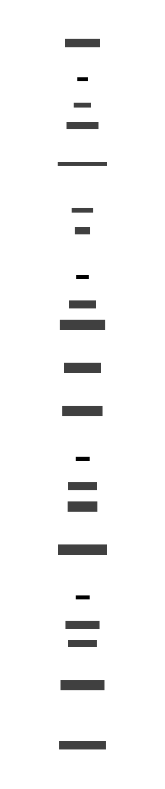

# CI/CD · PoC Local con Ministack

> **Fase:** Prueba de concepto — validación funcional del flujo CI/CD sin cuenta AWS real  
> **Stack:** GitHub Actions · Ministack (S3 local `:4566`) · Docker local · SageMaker SDK modo local  
> **Propósito:** Validar la estructura del repo, el workflow unificado y el upsert del pipeline en un entorno completamente local

---

## Resumen

El Data Scientist hace push a su rama `model-X` → GitHub Actions buildea las imágenes Docker localmente, sube el código a un S3 simulado (Ministack en `:4566`) y registra el pipeline con `LocalPipelineSession` — **sin tocar ningún servicio AWS real**.


---

## Estructura del repositorio

```
sagemaker-cicd-poc/
├── .github/
│   └── workflows/
│       └── cicd.yml              ← workflow único para todas las ramas model-*
├── docs/
│   ├── cicd-design.md            ← diseño objetivo (producción)
│   └── cicd-poc.md               ← este documento
├── scripts/
│   └── deploy_s3.py              ← sube model-X/ a S3 como tarballs por step
├── {model-name}/                 ← template base para nuevos modelos
│   ├── config.json
│   └── training/
│       ├── pipeline.py
│       └── artifacts/
│           ├── preprocessing/
│           │   ├── Dockerfile
│           │   ├── entrypoint.sh
│           │   └── main.py
│           ├── training/
│           │   ├── Dockerfile
│           │   ├── entrypoint.sh
│           │   └── main.py
│           └── validation/
│               ├── Dockerfile
│               ├── entrypoint.sh
│               └── main.py
├── model-1/                      ← branch model-1
├── model-2/                      ← branch model-2
└── model-3/                      ← branch model-3
```

> **Una branch por modelo.** El directorio lleva el mismo nombre que la branch: `model-1` → `model-1/`.  
> El workflow se dispara solo en la branch que recibe el push — sin paths filter, la convención de repo ya filtra.

---

## Flujo CI/CD — por modelo



> Los jobs corren **secuencialmente** en la PoC.  
> En el diseño objetivo, Job 2 (build) y Job 3 (upload) corren **en paralelo**.

---

## PoC vs Diseño objetivo

| Aspecto | PoC — actual | Diseño objetivo |
|---------|-------------|-----------------|
| Auth AWS | Credenciales fake hardcodeadas (`test/test`) | OIDC — `aws-actions/configure-aws-credentials@v6` |
| Registry de imágenes | Build local, sin push a registry | Push a ECR con doble tag `:step-SHA` + `:step` |
| S3 | Ministack en `:4566` | AWS S3 real |
| SageMaker | `LocalPipelineSession` | `PipelineSession` → SageMaker Studio |
| Calidad de código | `ruff check` | Ruff + Sonarcloud + Fluid Attacks SAST + Semgrep + Bandit |
| Paralelismo Job 2 ‖ Job 3 | Secuencial | Paralelo (`needs: quality` en ambos) |
| Tags Docker | Sin tag — build local descartable | `:step-SHA` inmutable + `:step` mutable |

---

## Componentes clave

### `cicd.yml` — workflow unificado

Un solo archivo cubre todos los modelos. `MODEL_NAME` se extrae del nombre de la branch en cada job:

```yaml
- name: Extract model name from branch
  run: echo "MODEL_NAME=${GITHUB_REF_NAME}" >> $GITHUB_ENV
```

Todos los paths son dinámicos: `$MODEL_NAME/training/artifacts/preprocessing/`, `$MODEL_NAME/config.json`, etc. No hay que modificar el workflow al agregar un nuevo modelo.

### `deploy_s3.py` — upload inteligente

- Lee `config.json` para obtener `s3_bucket` y `s3_prefix`
- Usa `git ls-files` para respetar `.gitignore` — no sube archivos no trackeados
- Por cada directorio bajo `artifacts/`, genera un `sourcedir.tar.gz` y lo sube a S3
- Compatible con cualquier endpoint S3 vía `--endpoint-url`

### `pipeline.py` — definición del grafo SageMaker

- `LocalPipelineSession` en modo PoC; `PipelineSession` en modo AWS real
- Lee `config.json` para `image_uri_*` por step, `role_arn` y `s3_bucket`
- `pipeline.upsert()` es **idempotente** — crea si no existe, actualiza si ya existe
- Flag `--upsert-only` en CI — nunca ejecuta el pipeline, solo registra la definición

### `config.json` — configuración por modelo

```json
{
    "account_id": "000000000000",
    "name_model": "model-X",
    "s3_bucket": "interbank-sagemaker-poc-bucket",
    "s3_prefix": "model_pipelines/model-X",
    "image_uri_preprocessing": "...:preprocessing",
    "image_uri_training":      "...:training",
    "image_uri_validation":    "...:validation",
    "role_arn": "arn:aws:iam::000000000000:role/SageMakerExecutionRole"
}
```

> En la PoC, `account_id` y `role_arn` usan valores placeholder — Ministack no los valida.

---

## Cómo agregar un nuevo modelo

```bash
# 1. Crear branch desde el template
git checkout -b model-N template

# 2. Renombrar el directorio placeholder
git mv '{model-name}' model-N

# 3. Actualizar la configuración del modelo
#    → model-N/config.json

# 4. Implementar la lógica de cada step
#    → model-N/training/artifacts/{preprocessing,training,validation}/main.py

# 5. Push — el CI/CD se dispara automáticamente
git push origin model-N
```

No hay que tocar el workflow ni crear ningún archivo de configuración adicional.

---

## Ministack — qué simula

[Ministack](https://github.com/ministackorg/ministack) es un contenedor Docker que expone una API compatible con AWS en `localhost:4566`.

| Servicio AWS | Soporte en Ministack | Notas |
|---|:---:|---|
| S3 | ✅ completo | `aws s3` CLI y `boto3` funcionan sin cambios |
| SageMaker | ✅ parcial | `LocalPipelineSession` usa S3 local para el upsert |
| ECR | ❌ no simulado | Las imágenes se buildean localmente y no se pushean |

El workflow levanta Ministack como **service container** en cada job que lo necesita:

```yaml
services:
  ministack:
    image: ministackorg/ministack:latest
    ports:
      - 4566:4566
```
