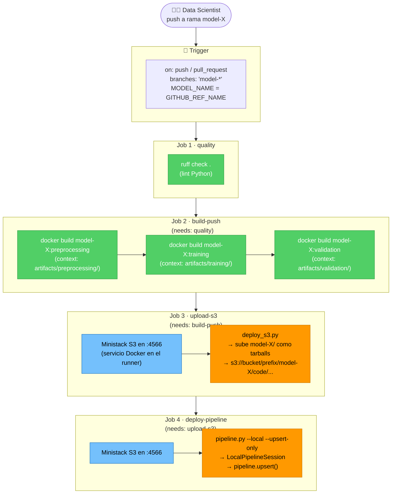

# CI/CD — PoC Local con Ministack

> **Contexto**: Prueba de concepto funcional del flujo CI/CD descripto en `cicd-diagram.md`.  
> **Stack**: GitHub Actions · Ministack (S3 local) · Docker local · SageMaker SDK (modo local)  
> **Propósito**: Validar la estructura del repo, el workflow unificado y el upsert del pipeline — sin cuenta AWS real.

---

## 1. La idea en una línea

> El Data Scientist hace push a su rama `model-X` → GitHub Actions buildea las imágenes Docker localmente, sube el código a un S3 simulado (Ministack en `:4566`) y registra el pipeline en SageMaker modo local → validado sin tocar AWS.

---

## 2. Estructura del repositorio

```
sagemaker-cicd-poc/
├── .github/
│   └── workflows/
│       └── cicd.yml              ← workflow único para todas las ramas model-*
├── docs/
│   ├── cicd-diagram.md           ← diseño objetivo
│   └── cicd-poc.md               ← este documento
├── scripts/
│   └── deploy_s3.py              ← sube model-X/ a S3 como tarballs por step
├── {model-name}/                 ← branch template (base para nuevos modelos)
│   ├── config.json
│   └── training/
│       ├── pipeline.py
│       └── artifacts/
│           ├── preprocessing/
│           │   ├── Dockerfile
│           │   ├── entrypoint.sh
│           │   └── main.py
│           ├── training/
│           │   ├── Dockerfile
│           │   ├── entrypoint.sh
│           │   └── main.py
│           └── validation/
│               ├── Dockerfile
│               ├── entrypoint.sh
│               └── main.py
├── model-1/                      ← branch model-1
├── model-2/                      ← branch model-2
└── model-3/                      ← branch model-3
```

> **Una branch por modelo.** El directorio del modelo lleva el mismo nombre que la branch: `model-1` → `model-1/`.  
> El workflow se dispara solo en la branch que recibe el push — no hay paths filter adicional porque la convención de repo ya filtra.

---

## 3. Flujo actual — por modelo



> Los jobs corren **secuencialmente** en la PoC.  
> En el diseño objetivo (`cicd-diagram.md`) Job 2 y Job 3 corren en paralelo.

---

## 4. Diferencias con el diseño objetivo

| Aspecto | PoC (actual) | Objetivo (`cicd-diagram.md`) |
|---------|-------------|------------------------------|
| Auth AWS | Credenciales fake hardcodeadas (`test/test`) | OIDC — `aws-actions/configure-aws-credentials@v6` |
| Registry de imágenes | Build local, sin push | Push a ECR con doble tag `:step-SHA` + `:step` |
| S3 | Ministack en `:4566` | AWS S3 real |
| SageMaker | `LocalPipelineSession` | `PipelineSession` → SageMaker Studio |
| Calidad de código | `ruff check` | `ruff` + Sonarcloud + Fluid Attacks SAST + Semgrep + Bandit |
| Paralelismo Job 2 ‖ Job 3 | Secuencial | Paralelo (`needs: quality` en ambos) |
| Tags Docker | Sin tag (build local descartable) | `:step-SHA` inmutable + `:step` mutable |

---

## 5. Componentes clave

### `cicd.yml` — workflow unificado

Un solo archivo cubre todos los modelos. `MODEL_NAME` se extrae del nombre de la branch en cada job:

```yaml
- name: Extract model name from branch
  run: echo "MODEL_NAME=${GITHUB_REF_NAME}" >> $GITHUB_ENV
```

Todos los paths son dinámicos: `$MODEL_NAME/training/artifacts/preprocessing/`, `$MODEL_NAME/config.json`, etc.

### `deploy_s3.py` — upload inteligente

- Lee `config.json` para obtener `s3_bucket` y `s3_prefix`
- Usa `git ls-files` para respetar `.gitignore` — no sube archivos no trackeados
- Por cada directorio bajo `artifacts/`, genera un tarball `sourcedir.tar.gz` y lo sube
- Compatible con cualquier endpoint S3 vía `--endpoint-url`

### `pipeline.py` — definición del grafo SageMaker

- `LocalPipelineSession` en modo PoC; `PipelineSession` en modo AWS real
- Lee `config.json` para `image_uri_*` por step, `role_arn`, `s3_bucket`
- `pipeline.upsert()` es idempotente — crea si no existe, actualiza si ya existe
- `--upsert-only` en CI — nunca ejecuta el pipeline, solo registra la definición

### `config.json` — configuración por modelo

```json
{
    "account_id": "000000000000",
    "name_model": "model-X",
    "s3_bucket": "interbank-sagemaker-poc-bucket",
    "s3_prefix": "model_pipelines/model-X",
    "image_uri_preprocessing": "...:preprocessing",
    "image_uri_training": "...:training",
    "image_uri_validation": "...:validation",
    "role_arn": "arn:aws:iam::000000000000:role/SageMakerExecutionRole"
}
```

En la PoC, `account_id` y `role_arn` usan valores placeholder — Ministack no los valida.

---

## 6. Cómo agregar un nuevo modelo

1. Crear branch desde `template`:
   ```bash
   git checkout -b model-N template
   ```
2. Renombrar el directorio placeholder:
   ```bash
   git mv '{model-name}' model-N
   ```
3. Actualizar `model-N/config.json` con los valores reales del modelo
4. Implementar la lógica en `model-N/training/artifacts/{step}/main.py`
5. Push — el CI/CD se dispara automáticamente:
   ```bash
   git push origin model-N
   ```

No hay que tocar el workflow ni crear ningún archivo de configuración adicional.

---

## 7. Ministack — qué simula

[Ministack](https://github.com/ministackorg/ministack) es un contenedor Docker que expone una API compatible con AWS en `localhost:4566`. En la PoC simula:

| Servicio AWS | Ministack |
|---|---|
| S3 | ✅ compatible — `aws s3` CLI y boto3 funcionan directo |
| SageMaker | ✅ partial — `LocalPipelineSession` del SDK usa S3 local para el upsert |
| ECR | ❌ no simulado — las imágenes se buildean localmente y no se pushean |

El workflow arranca Ministack como **service container** en cada job que lo necesita:

```yaml
services:
  ministack:
    image: ministackorg/ministack:latest
    ports:
      - 4566:4566
```
